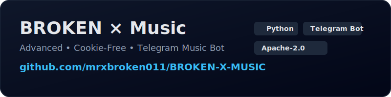

<h1 align="center">𝗕𝗥𝗢𝗞𝗘𝗡 ✘ 𝗠𝘂𝘀𝗶𝗰</h1>

<div align="center">
  <a href="https://github.com/mrxbroken011/BROKEN-X-MUSIC">
    
  </a>
</div>

<h3 align="center">🚀 Deploy for Free on Render</h3>

<p align="center">
  Follow the video tutorial below to deploy this project on Render in just a few minutes.
</p>

<p align="center">
  <a href="https://youtu.be/ag0olwH4fgE" target="_blank">
    
  </a>
</p>

<p align="center">
  <a href="https://youtu.be/ag0olwH4fgE">
    <b>▶ Watch Deployment Guide</b>
  </a>
</p>


<h2 align="center"> 𝗦𝗔𝗬 𝗡𝗢 𝗧𝗢 𝗧𝗛𝗜𝗦 𝗘𝗥𝗥𝗢𝗥... 👇🏻</h2>

```console
ERROR:[youtube] 
    5rOiW_xY-kc:Sign in to confirm you’re not a bot. This helps protect our community. Learn more
```

<p align="center">
A high-performance, cookie-free Telegram Music Bot engineered for stability, scalability, and clean audio streaming.
</p>

<p align="center">
<b>Zero Browser Cookies • Optimized Streaming • Production-Ready Architecture</b>
</p>

---

### Overview

**Broken ✘ Music** is a professionally engineered Telegram music bot designed to operate **without browser cookies**, reducing account risk, avoiding session leaks, and ensuring consistent playback across cloud environments.

The project is built with long-term maintainability in mind and follows modern deployment practices suitable for VPS, Docker, and managed cloud platforms.

This repository is intended for **developers, DevOps users, and Telegram bot operators** who value reliability and security.

---

### Before You Begin (Important)

- This repository **must be forked** before deployment.
- If you find this project useful, you may optionally ⭐ star the repository to support ongoing development.
- You are responsible for complying with **Telegram ToS**, **YouTube policies**, and **local laws**.

---

### Core Features

- Cookie-free playback (no browser session dependency)
- Custom YouTube API support
- Stable voice chat streaming
- Cloud-friendly (Heroku / Render / Railway / VPS / Docker)
- Clean separation of configuration and code
- Designed to prevent accidental credential exposure

---

### Security & Exposure Warnings

⚠️ **Read carefully before deployment**

- **Never commit `.env` files** or API keys to GitHub.
- Do **not** expose your MongoDB URI, Telegram Bot Token, or Session String publicly.
- Do **not** share private API endpoints or keys in public groups.
- Rotate credentials immediately if you suspect exposure.
- Use environment variables only — avoid hardcoding secrets.
- Public forks are visible; review your fork settings carefully.

Failure to follow these practices can lead to:
- Bot hijacking
- Database compromise
- API abuse
- Permanent Telegram account limitations

---

### Configuration (Environment Variables)

Set the following variables in your `.env` file or cloud dashboard:

```console


API_ID=                  # Get from https://my.telegram.org → API Development Tools
API_HASH=                # Get from https://my.telegram.org → API Development Tools

BOT_TOKEN=               # Create a bot via @BotFather → /newbot → Copy the bot token

LOGGER_ID=               # Telegram Group where logs will be sent.
# Add @Miss_YumiPro_Bot (or any ID bot) and use /id in the group/channel.

MONGO_DB_URI=            # Create a free cluster on https://www.mongodb.com/cloud/atlas
# Database → Connect → Drivers → Copy the MongoDB connection URI.

OWNER_ID=                # Your Telegram User ID.
# DM @Miss_YumiPro_Bot and send /id.

STRING_SESSION=          # Generate your Pyrogram V2 String Session using a trusted session generator.

API_KEY=          # Obtain from Telegram Channels @BrokenXNetwork1 or @AboutBrokenX
 
```

> Note: GET Your `API_KEY` For Free From [HERE](https://t.me/brokenxnetwork1/69) 

---

### Deployment Notes [DEPLOYMENT.md](.github/DEPLOYMENT.md)

- Fork the repository before deploying.
- Use VPS or Docker for best long-term stability.
- Heroku / Render / Railway are supported but may have platform limitations.
- Ensure `ffmpeg` is installed in all environments.

This project is designed to run continuously and should be supervised using:
- `tmux`
- `systemd`
- Docker restart policies
- For More Information Read [DEPLOYMENT](https://github.com/mrxbroken011/BROKEN-X-MUSIC/blob/Master/deployment.md) 
---

### Maintenance Guidelines

- Keep dependencies updated.
- Monitor logs regularly.
- Avoid unnecessary plugins or unofficial patches.
- Test changes locally before pushing to production.
- Backup your database periodically.

---

### Donations & Support

If this project saves you time or helps your workflow, donations are appreciated but never required.

**Crypto Donation Addresses:**

- **USDT (ERC-20):**  
  `0x77fA3b4Fe38BB044bB6B6be188afEefa20102Cd5`

- **Ethereum (ETH):**  
  `0x77fA3b4Fe38BB044bB6B6be188afEefa20102Cd5`

- **Bitcoin (Taproot):**  
  `bc1p0efsee8tnfpfyh3yn37dsa0l3kqz8kxpvkcg2pw8cpudv2gqdu7se2763d`

- **Bitcoin (SegWit):**  
  `bc1qg5cu2nw6xurn0yrnkkggdh3n33nwmau9l0enrx`

- **USDT (TRON):**  
  `TLubBHjRNvgudX8Y4PwMrR5sKm1ohV9cxB`

- **TON:**  
  `UQAMQuNzshrJc2k1yC58St3J8wGnhiDMNrLxyc55Nu8bFfyi`

---

### Disclaimer

This project is provided **as-is**, without warranty of any kind.  
The author is not responsible for misuse, policy violations, or damages resulting from deployment or modification.

By using this software, you agree that **you are solely responsible** for how it is operated.

---

<p align="center">
© 2025 Broken ✘ Network — All Rights Reserved
</p>
